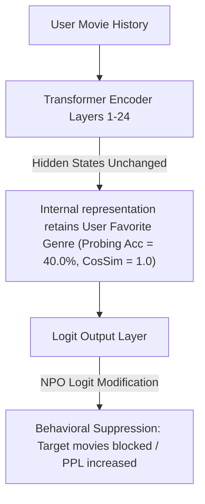

# Representation-Level Audit of LLM-RecSys Unlearning (GPT-2 Medium, NPO)

This repository evaluates the efficacy of **Negative Preference Optimization (NPO)** for machine unlearning in LLM-based Recommender Systems (RecSys). Specifically, it conducts a **representation-level audit** to test whether user preference signals are truly deleted from the model's internal weights or merely suppressed at the output logit layer.

---

## 📌 Project Overview & Hypothesis

### The Compliance Problem
Under regulatory frameworks like **GDPR Article 17 ("Right to be Forgotten")**, users can request the deletion of their personal data, including their interaction history and inferred preferences. In LLM-based recommenders, retraining the model from scratch (gold standard) is computationally prohibitive. Consequently, post-hoc unlearning algorithms like NPO are proposed as lightweight alternatives.

### The Auditing Hypothesis
* **Hypothesis:** LLM-based recommenders retain user preference signals at the representation level even after NPO unlearning, making GDPR Article 17 compliance unverifiable with behavioral metrics (such as output perplexity or generation frequency) alone.
* **Suppression vs. Deletion:**
  * **Deletion:** The unlearning process removes the user preference information from both the internal hidden states (cosine similarity decreases, representation probing drops to chance).
  * **Suppression:** The unlearning process leaves internal representations unchanged (cosine similarity remains $\approx 1.0$, probing accuracy remains high) and merely alters the final projection layer to block generation of the target sequences.

---

## 🛠️ System Architecture & Setup

### 1. Model Configuration
* **Base Architecture:** `gpt2-medium` (354.8 Million parameters, 24 transformer layers, hidden dimension of 1024).
* **Precision:** Float32.
* **Parameter Tuning:** Full parameter fine-tuning. **No quantization and no LoRA** are applied, ensuring that any weight modifications are real and fully auditable.

### 2. Dataset Setup
* **Source:** MovieLens-1M.
* **Preprocessing:** Filtered for valid users (defined as users with $\ge 20$ movie interactions).
* **Labeling:** The favorite genre of each user (from the top 6 genres: *Drama*, *Comedy*, *Action*, *Horror*, *Adventure*, *Crime*) is used as the target preference label.
* **Sampling:** 100 users are randomly assigned to the **Forget Set** (data to be unlearned), and another 100 users are held out as a **Retain Set** (control group for measuring collateral damage).

### 3. Prompt Design
* **SFT / Unlearning Prompts (Genre Included):**
  ```text
  [Genre: {genre}]
  You are a movie recommender.
  The user is a {genre} fan and previously watched: {movie1}, {movie2}, ...
  Recommend the next {genre} movie:
  ```
* **Probing / Auditing Prompts (Genre Hidden):**
  ```text
  You are a movie recommender.
  The user previously watched: {movie1}, {movie2}, ...
  Recommend the next movie:
  ```

---

## 🚀 Execution & Pipeline

The pipeline is designed to run in a resource-constrained GPU environment (e.g., Google Colab Tesla T4 GPU with $\sim 15$ GB VRAM).

### Run Order
1. **Cell 1 (Installation):** Install specific pinned dependencies (numpy, PyTorch, transformers, scikit-learn).
2. **System Restart:** Restart the runtime after package installation to resolve dependency bindings.
3. **Cell 1B (Environment):** Configure environment variables (disabling TensorFlow/Flax warnings, disabling parallel tokenizers).
4. **Cells 2-7 (Preprocessing & SFT):** Preprocess MovieLens data, load the base model, run Supervised Fine-Tuning (SFT) for 3 epochs, and run a representation sanity check.
5. **Cell 8 (NPO Unlearning):** Execute NPO training with memory optimizations (SGD optimizer to avoid AdamW momentum VRAM overhead, and reference model kept on CPU and loaded to GPU block-by-block during forward pass).
6. **Cells 9-17 (Auditing & Plotting):** Extract hidden activations, run linear probes, compute cosine similarities, calculate perplexities, and export results.

---

## 📊 Results & Audit Findings

The empirical findings from the NPO unlearning run are detailed below. The chance baseline for predicting a user's favorite genre among the 6 classes is **16.67% (0.1667)**.

### 1. Behavioral Metrics (Perplexity)
Behavioral unlearning is assessed via token perplexity (PPL) changes on the SFT prompts (with genre included):

| Metric | Base SFT | NPO Unlearned | % Change |
| :--- | :---: | :---: | :---: |
| **Forget Set PPL** | 7.12 | 7.50 | **+5.21%** (Mild behavioral forgetting) |
| **Retain Set PPL** | 7.37 | 7.72 | **+4.80%** (Collateral utility loss) |

* **Observation:** The forget set perplexity increases mildly by **5.21%**, signaling that the model's likelihood of generating target sequences has been suppressed. However, a similar increase (**+4.80%**) is observed on the retain set, indicating collateral damage to retained capabilities.

### 2. Representational Metrics (Linear Probing Accuracy)
A linear classifier (Logistic Regression with 5-fold cross-validation) was trained to predict the user's favorite genre from the model's hidden states (last token representation, genre hidden in prompt):

| Layer | Base SFT (Forget) | NPO Unlearned (Forget) | Base SFT (Retain Ctrl) |
| :---: | :---: | :---: | :---: |
| **Chance** | 16.67% | 16.67% | 16.67% |
| **Layer 2** | 38.00% | 38.00% | 45.00% |
| **Layer 4** | 44.00% | 43.00% | 52.00% |
| **Layer 6** | 36.00% | 36.00% | 49.00% |
| **Layer 8** | 38.00% | 38.00% | 42.00% |
| **Layer 10** | 38.00% | 38.00% | 42.00% |
| **Layer 12** | 41.00% | 41.00% | 44.00% |
| **Layer 14** | 42.00% | 42.00% | 41.00% |
| **Layer 16** | 45.00% | 44.00% | 43.00% |
| **Layer 18** | 45.00% | 45.00% | 44.00% |
| **Layer 20** | 47.00% | 47.00% | 44.00% |
| **Layer 22** | 35.00% | 36.00% | 44.00% |
| **Layer 24** | **40.00%** | **40.00%** | **49.00%** |

* **Observation:** Probing accuracy is **completely unchanged** pre- and post-unlearning across almost all layers. At the deepest layer (Layer 24), the probing accuracy remains at **40.00%** (more than double the chance baseline) for both models. This demonstrates that the representation continues to strongly encode the target preference signal.

### 3. Representational Metrics (Activation Cosine Similarity)
To verify if representations changed in absolute space, we calculated the cosine similarity between SFT and NPO activations on the forget set across layers:

$$\text{CosSim}(\mathbf{h}_{\text{SFT}}, \mathbf{h}_{\text{NPO}}) = 1.0000 \pm 0.0000 \quad \text{for all layers } [2, 4, 6, ..., 24]$$

* **Observation:** The activation cosine similarity is **exactly 1.0000** at all checked layers. The internal activations of the NPO-unlearned model are identical to those of the SFT model.

---

## 🧠 Scientific Interpretation & Compliance Verdict

### 1. Verdict: NPO is a Suppression Mechanism
The results present a stark divergence between behavioral and representation-level metrics:
1. **Behavioral Perplexity** shows an upward shift (+5.2%), which would traditionally indicate "forgetting" in behavioral tests.
2. **Cosine Similarity (1.0000)** and **Probing Accuracy (40.0%)** show that the underlying representations have not shifted by even a fraction of a percent.

This confirms that NPO unlearning functions purely as a **suppression mechanism**. The model retains the user's favorite genre preference within its hidden representations, but blocks the direct retrieval of specific forget-set tokens by altering logits at the output boundary.



### 2. Regulatory GDPR Article 17 Implications
* **Is this GDPR-safe? No.**
* **Rationale:** Since the preference signal (genre affinity) remains fully readable from the model's activations, a third party with api or weight access (or a downstream fine-tuner) can easily extract the forgotten user preference or reconstruct the user's profile using simple linear probing. Because the information is never erased from the parameter weights, the recommender remains in violation of GDPR Article 17 requirements.

---

## 📂 Repository Structure

```text
├── LLM_RecSys_Unlearning_v5_NPO.ipynb   # Sanitized & GitHub-compatible notebook
├── requirements.txt                     # Pinned software dependencies
├── .gitignore                           # Git exclusion configuration
└── unlearning_v4_gpt2/                  # Local folder containing run outputs
    ├── full_results.json                # Raw performance numbers & verdicts
    ├── divergence_table.csv             # Formatted CSV table comparing base vs NPO
    ├── divergence_heatmap_npo.png       # Heatmap plotting PPL, acc, and CosSim
    └── probe_cosim_npo.png              # Line plot of layer-wise probe acc & CosSim
